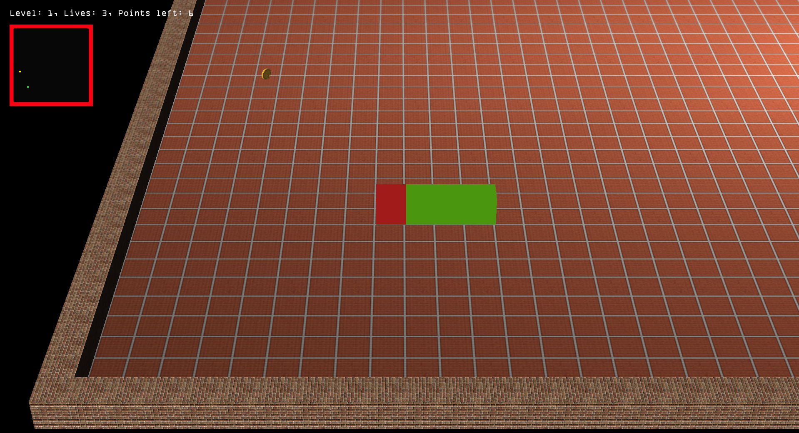
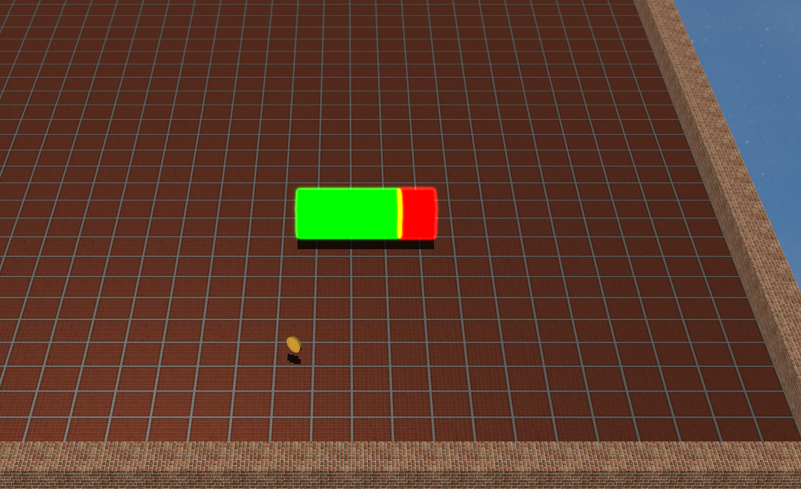
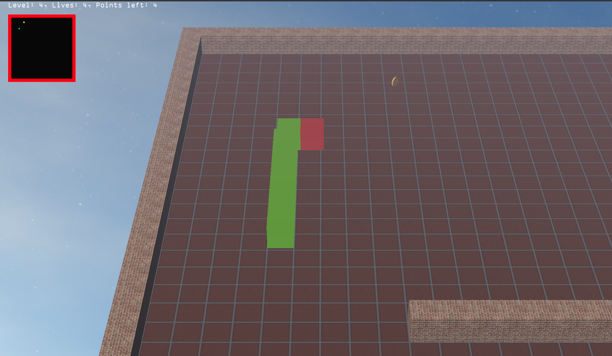

# Snake3d
Modern C++ Opengl 3D Snake example.

### Controls:
- J, I, K, L - snake move
- R - hide / show radar
- M - stop / play music
- V - show / hide shadows
- B - enable / disable blur effect
- F - enable / disable fog effect
- W - enable / disable rain and rain drops
- 1 - switch to cube head
- 2 - switch to pacman head

and with shadows and skybox

and blur effect activated

and fog effect

and rain with drops

### Dependencies:
- assimp - https://assimp-docs.readthedocs.io/en/latest/
- stb_image - v2.27 - public domain image loader - http://nothings.org/stb
- tiny_obj_loader - v2.00 - obj model loader - https://github.com/tinyobjloader/tinyobjloader
- OpenAL
- ALut
- freetype2
- GLFW3
- glut, GLU, GL, GLEW

### Tutorials:
- https://learnopengl.com