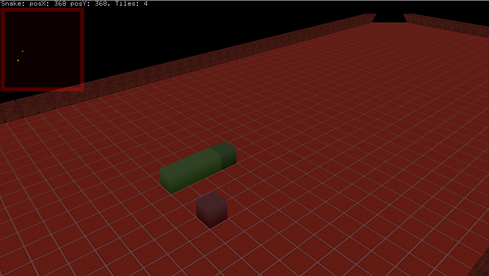
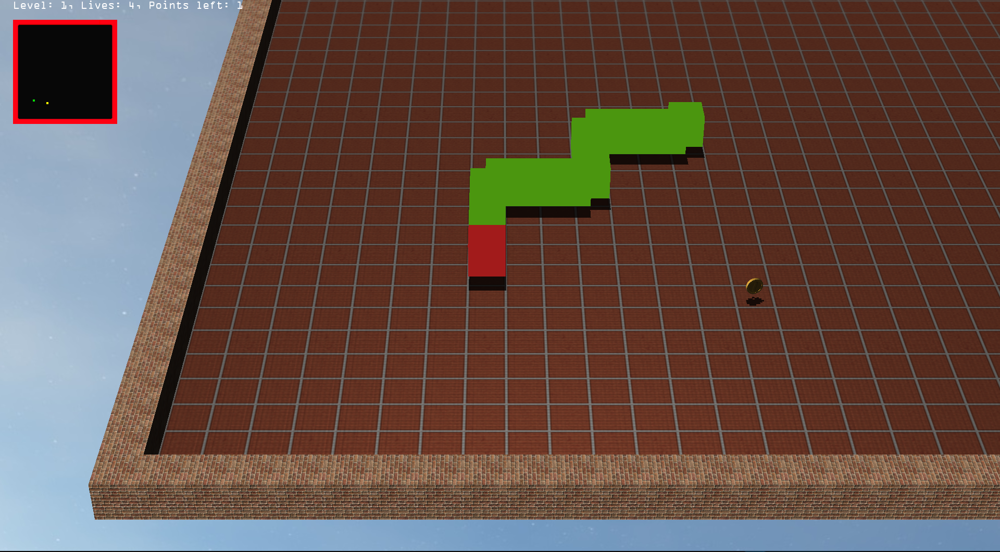

# Snake3d
Modern C++ Opengl 3D Snake example.

### Controls:
- J, I, K, L - snake move
- R - hide / show radar
- M - stop / play music
- V - show / hide shadows

and with shadows and skybox

### Dependencies:
- stb_image - v2.27 - public domain image loader - http://nothings.org/stb
- tiny_obj_loader - v2.00 - obj model loader - https://github.com/tinyobjloader/tinyobjloader
- OpenAL
- ALut
- freetype2
- GLFW3
- glut, GLU, GL, GLEW

### Tutorials:
- https://learnopengl.com