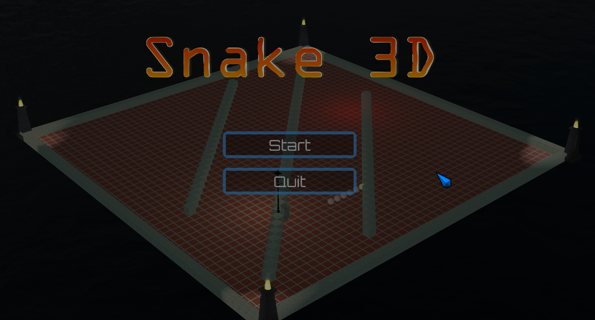
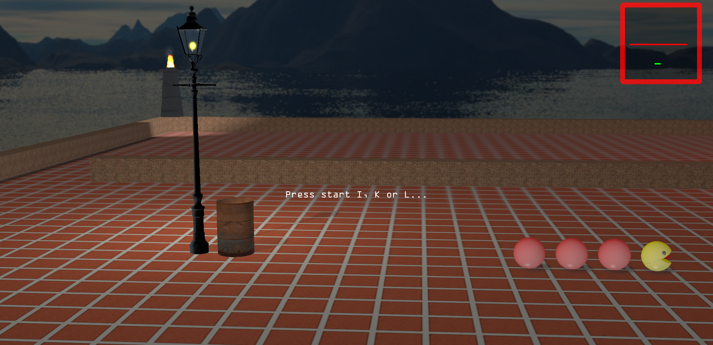

# Snake3d
Modern C++ Opengl 3D Snake example.

### Controls:
- J, I, K, L - snake move
- R - hide / show radar
- M - stop / play music
- V - show / hide shadows
- B - enable / disable bloom

and game detail

### Dependencies:
- assimp - v5.2 https://github.com/assimp/assimp
- stb_image - v2.27 - public domain image loader - http://nothings.org/stb
- OpenAL
- ALut
- freetype2
- GLFW3
- glut, GLU, GL, GLEW
- nlohman (json)
- libenet

### Tutorials:
- https://learnopengl.com